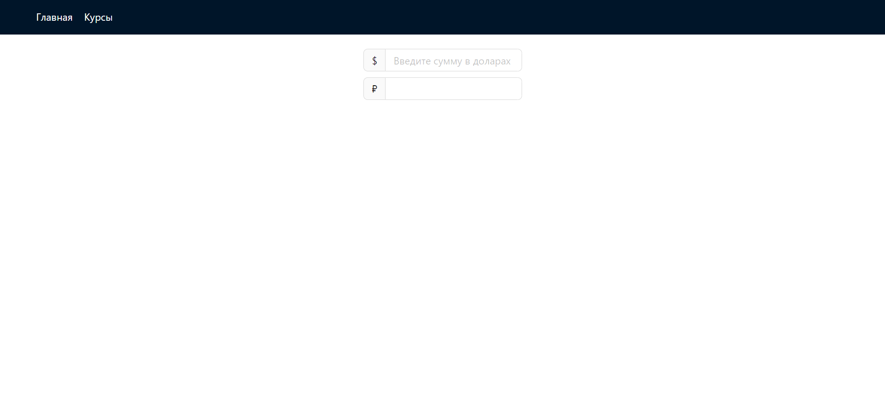

# Currency conversion

**Вы также можете прочитать этот README на [русском](https://github.com/klekwedge/rostelecom-test-task/blob/main/README.md)**

## Table of contents

- [Deployment instructions](#deployment-instructions)
- [Overview](#overview)
  - [Screenshot](#screenshot)
  - [Links](#links)
- [My process](#my-process)
  - [Built with](#built-with)
  - [What I learned](#what-i-learned)
- [Author](#author)

## Deployment instructions

**To run the project, you need to have [npm](https://nodejs.org/en/) and [git](https://git-scm.com/downloads) installed on your computer**

1. Make a clone of this repository ```git clone https://github.com/klekwedge/rostelecom-test-task.git```
2. Install all required npm packages with ```npm i```
3. Run the project with the command ```npm run dev```

## Overview

Implement SPA for currency conversion. To get current rates, find and use any open API (for example, https://api.exchangeratesapi.io/latest).

**Application must consist of two pages:**
1. Converter from one currency to another. This page should have a text field where you can enter text in the form of 15 usd in rub and get the result;

2. Page with current exchange rates supporting pagination/filtering. On this page, the user should see "fresh" exchange rates relative to the base currency - for example, if the base currency is the ruble, then the user sees that 1 USD = 63.49 RUB, and 1 EUR = 72.20;

3. Model window with the ability to view the dynamics of the selected currency on the timeline;

By default, the user must define the "base" currency, which he can configure.

**Plus will be:**
- Well-designed interface and appearance
- The maximum speed of the application (both when downloading the application and when converting currencies)

**To implement use**
- React\Typescript

**At your discretion:**
- Any library for working with the store (redux, mobx, etc.)
- Any libraries you deem appropriate.

You can complete the task in your github account, or send a zip-archive with your code and documentation on it. Keep in mind that the libraries you choose may not be on the reviewer's computer. Therefore, the documentation should describe how to install everything that is necessary for the program to work, how to build it and run it. It is desirable that all this is done by the package manager.

### Screenshot



### Links

- [Solution URL](https://github.com/klekwedge/rostelecom-test-task)
- [Live Site URL](https://klekwedge-rostelecom-test-task.vercel.app/)

## My process

### Built with

- React
- TypeScript
- Redux Toolkit
- SCSS
- Chakra UI

### What I learned

## Author

- [Website](https://klekwedge-cv.vercel.app/)
- [Linkedin](https://www.linkedin.com/in/klekwedge/)
- [Facebook](https://www.facebook.com/klekwedge)

