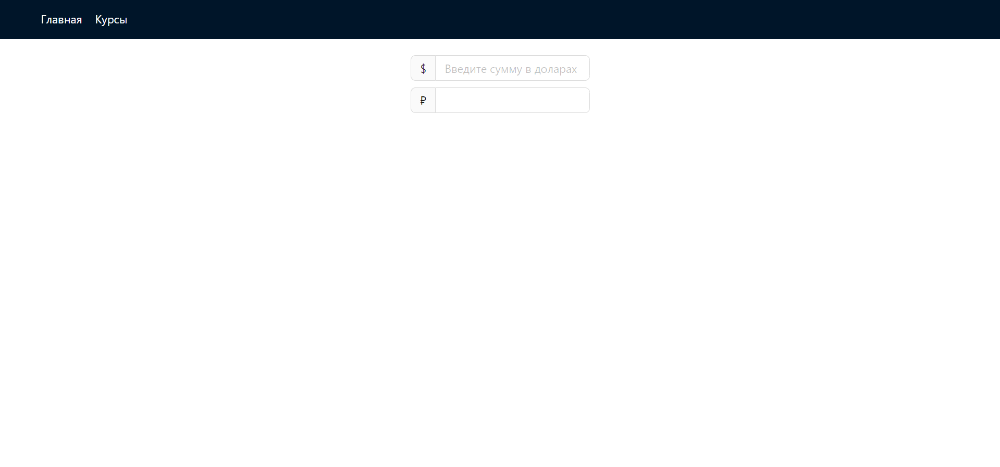

# Конвертирования валют


## Оглавление

- [Инструкции по развертыванию](#инструкции-по-развертыванию)
- [Обзор](#обзор)
  - [Скриншот](#скриншот)
  - [Ссылки](#ссылки)
- [Мой процесс](#мой-процесс)
  - [Стек](#стек)
- [Автор](#автор)

## Инструкции по развертыванию

**Для запуска проекта на вашем компьютере должны быть установлены [npm](https://nodejs.org/en/) и [git](https://git-scm.com/downloads)**

1. Сделайте клон этого репозитория ```git clone https://github.com/klekwedge/rostelecom-test-task.git```
2. Установите все необходимые пакеты npm с помощью ```npm i```
3. Запустите проект командой ```npm run dev```

## Обзор

Реализуйте SPA для конвертирования валют. Для получения текущих курсов найдите и используйте любое отрытое API (например https://api.exchangeratesapi.io/latest).

**Приложение должно состоять из двух страниц:**
1. Конвертер из одной валюты в другую. На этой странице должно быть текстовое поле, в которое можно ввести текст в виде 15 usd in rub и получить результат;

2. Страница с текущими курсами валют, поддерживающая пагинацию/фильтрацию. На этой странице пользователь должен видеть «свежие» курсы валют относительно базовой валюты — например, если базовая валюта — рубль, то пользователь видит, что 1 USD = 63.49 RUB, а 1 EUR = 72.20;

3. Модельное окно с возможностью посмотреть динамику изменения курса выбранной валюты на таймлайне;

По-умолчанию у пользователя должна определяться «базовая» валюта, которую он может настроить.

**Плюсом будет:**
- Хорошо продуманный интерфейс и внешний вид
- Максимальная скорость работы приложения (как при загрузке приложения, так и при конвертировании валют)

**Для реализации используйте**
- React\Typescript

**На ваше усмотрение:**
- Любую библиотеку для работы со стором (redux, mobx и т.д.)
- Любые библиотеки, которые считаете уместными.

Задание вы можете выполнить в своем github аккаунте, либо присылать zip-архив с вашим кодом и документацией по нему. Имейте в виду, что выбранных вами библиотек может не быть на компьютере проверяющего. Поэтому в документации должно быть описано, как установить все, что необходимо для работы программы, как ее собрать и запустить. Желательно, чтобы все это делал пакетный менеджер.

### Скриншот



### Ссылки

- [Ссылка на проект](https://github.com/klekwedge/rostelecom-test-task)
- [Деплой](https://klekwedge-rostelecom-test-task.vercel.app/)

## Мой процесс

### Стек

- React
- TypeScript
- Redux Toolkit
- SCSS
- AntD
- React Router

## Автор

- [Вебсайт](https://klekwedge-cv.vercel.app/)
- [Linkedin](https://www.linkedin.com/in/klekwedge/)
- [Facebook](https://www.facebook.com/klekwedge)
